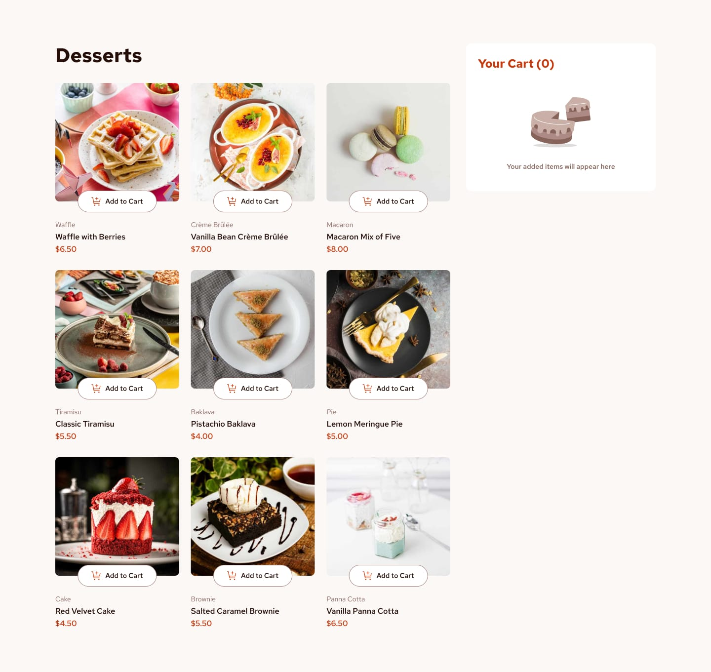

# Frontend Mentor - Product list with cart

### The challenge

The users able to:

- Add items to the cart and remove them
- Increase/decrease the number of items in the cart

- See an order confirmation modal when they click "Confirm Order"
- Reset their selections when they click "Start New Order"

- View the optimal layout for the interface depending on their device's screen size
- See hover and focus states for all interactive elements on the page

### Built with

- React
- Tailwind css
- Fetch data.json

### Links

- [live site URL here](https://product-list-cart-sable.vercel.app/)

# Getting Started with Create React App

This project was bootstrapped with [Create React App](https://github.com/facebook/create-react-app).

## Available Scripts

In the project directory, you can run:

### `npm start`
